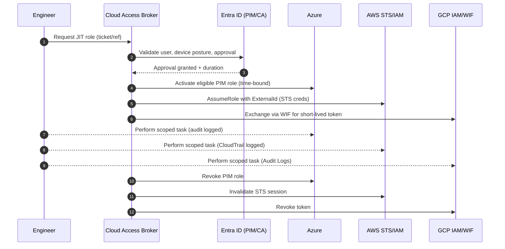

# Cloud Access Broker — Just-in-Time (JIT) Admin for Multi-Cloud (Azure • AWS • GCP) 🚀


> **Concept:** A provider-agnostic **Cloud Access Broker** that delivers **time-bound, least-privilege** administrative access across **Azure**, **AWS**, and **GCP**.  
> Designed for environments where engineers require elevated access under controlled, auditable, and policy-driven conditions.

---

## 🎯 Objective

- Enable **Just-in-Time (JIT)** elevation across multiple cloud providers.  
- Integrate **identity governance**, **conditional access**, and **short-lived credentials**.  
- Maintain full **audit visibility** and **compliance alignment** (ISO 27001, SOC2, CIS).  
- Remove standing admin permissions and reduce attack surface.  

---

## 🧭 Lifecycle Stages

1. **Discover** — Identify privileged roles, identities, and elevation pathways across all clouds.  
2. **Design** — Define JIT RBAC roles, durations, and approval workflows.  
3. **Build** — Establish trust models (Azure PIM, AWS IAM + External ID, GCP WIF).  
4. **Integrate** — Implement automation and approval logic using Entra, ITSM, or custom brokers.  
5. **Pilot** — Validate least-privilege, time-limited access across selected accounts or projects.  
6. **Harden** — Enforce MFA, device compliance, location restrictions, and logging.  
7. **Cutover** — Transition from standing admin access to JIT-managed access.  
8. **Operate** — Maintain runbooks, periodic access reviews, and SIEM correlation.  
9. **Evolve** — Extend model to additional tenants, accounts, or environments.

---

## 🗺️ Reference Flow (Mermaid)



---

## 🧩 Repository Structure

| Path | Description |
|------|--------------|
| `README.md` | Project overview, lifecycle, and diagram |
| `RUNBOOK.md` | Operational steps for access request, approval, and audit |
| `docs/OVERVIEW.md` | Scope and high-level summary |
| `docs/ARCHITECTURE.md` | Trust and federation model |
| `docs/CUTOVER_CHECKLIST.md` | Go-live checklist |
| `docs/ROLLBACK.md` | Safe revert plan |
| `docs/SECURITY.md` | Controls, posture, and redaction statement |
| `scripts/` | Example automation placeholders (Azure/AWS/GCP) |

---

## ☁️ Multi-Cloud Model

### **Azure**
- Entra ID PIM with eligible roles.  
- Conditional Access enforcing MFA + compliant device.  
- Role duration limited to ≤ 60 minutes.

### **AWS**
- IAM Roles trusted to an IdP using **OIDC/SAML** with **External ID**.  
- Session policies restrict actions and enforce short TTL.  
- CloudTrail logging enabled for all activity.

### **GCP**
- **Workload Identity Federation (WIF)** using OIDC trust.  
- Role bindings use temporary impersonation tokens.  
- Audit logs streamed to Cloud Logging and SIEM.

---

## ✅ Governance & Audit

- Every elevation is linked to a **ticket or change reference**.  
- **Logs** captured in Entra, Azure Activity, CloudTrail, and GCP Audit Logs.  
- **Access reviews** scheduled quarterly per compliance framework.  
- Break-glass accounts held under dual control, reviewed post-use.

---

## 🔒 Security Posture

- Least privilege enforced by role design and session policies.  
- Conditional Access gates all privileged sessions.  
- Credentials expire automatically.  
- Repository contains **no secrets, IPs, tenant identifiers, or customer data**.

---

## 🧰 Getting Started

```bash
git init
git add .
git commit -m "feat: cloud access broker JIT docs (initial)"
git branch -M main
git remote add origin <your-repo-url>
git push -u origin main
```

---

## 📄 License

MIT License — for educational and professional adaptation.
